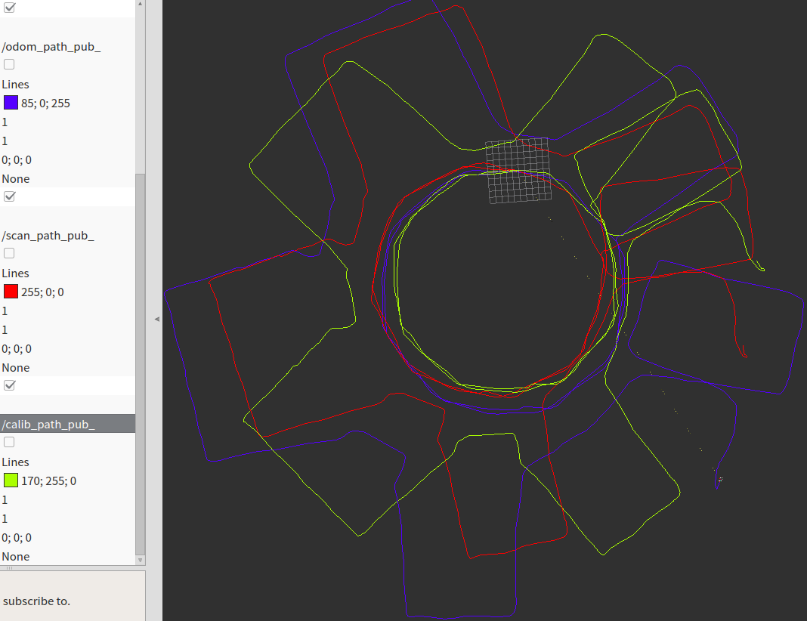
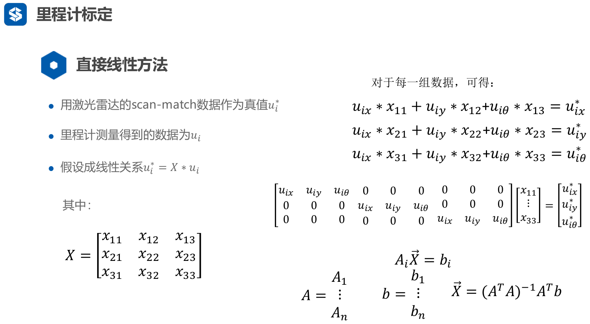
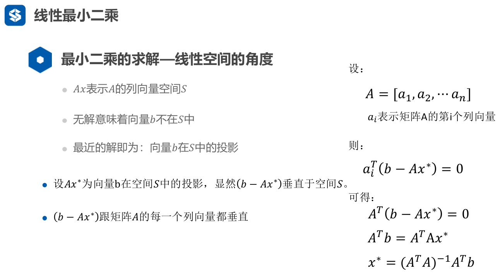

1.    本次(第二课ppt)的作业为用直接线性方法来对机器人的里程计进行校正。

2.    本次作业使用的bag数据，路径为odom_ws/bag/odom.bag（太大了，没上传到github）。

3.    本次的作业中，需要实现三个函数，分别为：

 -   [x] main.cpp，第340行中的cal_delta_distance()函数，该函数的功能为给定两个里程计位姿，计算这两个位姿之间的位姿差。

 -   [x] Odom_Calib.cpp，第23行Add_Data()函数，该函数的功能为构建超定方程组Ax=b，具体参考PPT。

 -   [x] Odom_Calib.cpp，第44行 Solve()函数，该函数的功能为对2中构建的超定方程组进行求解。


本次程序的运行过程为：
1.    运行launch文件:roslaunch  calib_odom odomCalib.launch。执行本条指令的时候，必须保证没有任何ros节点在运行，roscore也要关闭。

2.    在 1 正常的情况下，运行rviz，fix_frame选择为odom_frame。在Add选项卡中增加三条Path消息。一条订阅的topic为：odom_path_pub_;一条订阅的topic为:scan_path_pub_；最后一条为:calib_path_pub_。分别选择不同的颜色。

3.    进入到odom_ws/bag目录下，运行指令：rosbag play - -clock odom.bag。(双横线中间不空格)

4.    如果一切正常，则能看到运行矫正程序的终端会打印数据，并且rviz中可以看到两条路径。当打印的数据到达一个的数量之后，则可以开始矫正。

5.    矫正的命令为，在calib_flag的topic下发布一个数据：rostopic pub /calib_flag std_msgs/Empty “{}”。

6.    程序矫正完毕会输出对应的矫正矩阵，并且会在rviz中显示出第三条路径，即calib_path。可以观察里程计路径odom_path和矫正路径_calib_path区别来判断此次矫正的效果。

      

      蓝色为里程计得到的路径，红色为激光（以里程计为迭代初始值）icp匹配的路径，黄色为最小二乘矫正的路径。(确实黄色路径更准确)

## 代码解读

​	学会用csm库的icp接口制作一个激光里程计。

###激光回调函数入口

```c
void Scan2::scanCallBack(const sensor_msgs::LaserScan::ConstPtr &_laserScanMsg)
{
    static long int dataCnt = 0;
    sensor_msgs::LaserScan scan;
    Eigen::Vector3d odom_pose;              //激光对应的里程计位姿
    Eigen::Vector3d d_point_odom;           //里程计计算的dpose
    Eigen::Vector3d d_point_scan;           //激光的scanmatch计算的dpose
    Eigen::MatrixXd transform_matrix(3,3);  //临时的变量

    double c,s;
    scan = *_laserScanMsg;

    //得到对应的里程计数据
    if(!getOdomPose(odom_pose, _laserScanMsg->header.stamp))
        return ;

    //前后两帧里程计的位姿差
    d_point_odom = cal_delta_distence(odom_pose);

    //如果运动的距离太短，则不进行处理．
    if(d_point_odom(0) < 0.05 &&
       d_point_odom(1) < 0.05 &&
       d_point_odom(2) < tfRadians(5.0))
    {
        return ;
    }
    last_pos = now_pos;

    //记录下里程计的增量数据
    odom_increments.push_back(d_point_odom);


    //把当前的激光数据转换为 pl-icp能识别的数据 & 进行矫正
    //d_point_scan就是用激光计算得到的两帧数据之间的旋转 & 平移
    LDP currentLDP;
    if(m_prevLDP != NULL)
    {
        LaserScanToLDP(&scan,currentLDP);
        d_point_scan = PIICPBetweenTwoFrames(currentLDP,d_point_odom);
    }
    else
    {
        LaserScanToLDP(&scan,m_prevLDP);
    }

    // 构造旋转矩阵 生成三种位姿

    // 两针scan计算本身累计的位姿 for laser_path visualization
    c = cos(scan_pos_cal(2));
    s = sin(scan_pos_cal(2));
    transform_matrix<<c,-s,0,
                      s, c,0,
                      0, 0,1;
    scan_pos_cal+=(transform_matrix*d_point_scan);

    // 里程计累计的位姿          for odom_path visualization
    c = cos(odom_pos_cal(2));
    s = sin(odom_pos_cal(2));
    transform_matrix<<c,-s,0,
                      s, c,0,
                      0, 0,1;
    odom_pos_cal+=(transform_matrix*d_point_odom);

    //放到路径当中 //for visualization
    pub_msg(odom_pos_cal,path_odom,odom_path_pub_);
    pub_msg(scan_pos_cal,path_scan,scan_path_pub_);

    //构造超定方程组
    Odom_calib.Add_Data(d_point_odom,d_point_scan);
    dataCnt++;

    std::cout <<"Data Cnt:"<<dataCnt<<std::endl;
}
```

###PIICP匹配函数

​	在PIICPBetweenTwoFrames函数里利用==csm库里的sm_icp函数==算得帧间的r和t（以里程计得到的帧间r和t作为迭代初始值），scan匹配优化得到激光里程计（原理在gmapping文件夹下第四课的pdf）。最小二乘的原理解释可以记一下。

```c
//求两帧之间的icp位姿匹配
Eigen::Vector3d  Scan2::PIICPBetweenTwoFrames(LDP& currentLDPScan,
                                              Eigen::Vector3d tmprPose)
{
    m_prevLDP->odometry[0] = 0.0;
    m_prevLDP->odometry[1] = 0.0;
    m_prevLDP->odometry[2] = 0.0;

    m_prevLDP->estimate[0] = 0.0;
    m_prevLDP->estimate[1] = 0.0;
    m_prevLDP->estimate[2] = 0.0;

    m_prevLDP->true_pose[0] = 0.0;
    m_prevLDP->true_pose[1] = 0.0;
    m_prevLDP->true_pose[2] = 0.0;

    //设置匹配的参数值
    m_PIICPParams.laser_ref = m_prevLDP;//优化参数，前一帧
    m_PIICPParams.laser_sens = currentLDPScan;//后一帧

    m_PIICPParams.first_guess[0] = tmprPose(0);
    m_PIICPParams.first_guess[1] = tmprPose(1);
    m_PIICPParams.first_guess[2] = tmprPose(2);

    m_OutputResult.cov_x_m = 0;
    m_OutputResult.dx_dy1_m = 0;
    m_OutputResult.dx_dy2_m = 0;

    sm_icp(&m_PIICPParams,&m_OutputResult);

    //nowPose在lastPose中的坐标
    Eigen::Vector3d  rPose;
    if(m_OutputResult.valid)
    {
        //得到两帧激光之间的相对位姿
        rPose(0)=(m_OutputResult.x[0]);
        rPose(1)=(m_OutputResult.x[1]);
        rPose(2)=(m_OutputResult.x[2]);

//        std::cout <<"Iter:"<<m_OutputResult.iterations<<std::endl;
//        std::cout <<"Corr:"<<m_OutputResult.nvalid<<std::endl;
//        std::cout <<"Erro:"<<m_OutputResult.error<<std::endl;

//        std::cout <<"PI ICP GOOD"<<std::endl;
    }
    else
    {
        std::cout <<"PI ICP Failed!!!!!!!"<<std::endl;
        rPose = tmprPose;
    }

    //更新

    //ld_free(m_prevLDP);

    m_prevLDP = currentLDPScan;

    return rPose;
}
```

###构造最小二乘的方程

​	将3×3的，包含9个待求变量，变成1×9的向量x，构建Ax=b的最小二乘方程。



```c
/*
输入:里程计和激光数据

TODO:
构建最小二乘需要的超定方程组
Ax = b

*/
bool OdomCalib::Add_Data(Eigen::Vector3d Odom,Eigen::Vector3d scan)
{

    if(now_len<INT_MAX)
    {
        //TODO: 构建超定方程组
        A(now_len%data_len*3,0)=Odom(0);
        A(now_len%data_len*3,1)=Odom(1);
        A(now_len%data_len*3,2)=Odom(2);
        A(now_len%data_len*3+1,3)=Odom(0);
        A(now_len%data_len*3+1,4)=Odom(1);
        A(now_len%data_len*3+1,5)=Odom(2);
        A(now_len%data_len*3+2,6)=Odom(0);
        A(now_len%data_len*3+2,7)=Odom(1);
        A(now_len%data_len*3+2,8)=Odom(2);

        b(now_len%data_len*3)=scan(0);
        b(now_len%data_len*3+1)=scan(1);
        b(now_len%data_len*3+2)=scan(2);

        //end of TODO
        now_len++;
        return true;
    }
    else
    {
        return false;
    }
}
```

###最小二乘公式理解

